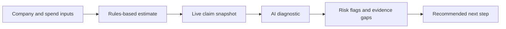

# RDKit Claim Assist Methodology

## Purpose

RDKit Claim Assist is designed to turn a simple R&D Tax Incentive calculator into a guided claim discovery tool.

The goal is not to replace a tax adviser or produce a lodgement-ready claim. The goal is to help a founder, finance lead, or accountant quickly understand three things:

1. What the estimated R&D offset could be.
2. Whether the benefit is likely to be current cash, tax reduction, or a carried-forward offset.
3. What claim evidence and follow-up questions should be prepared before RDKit reviews the claim.

This methodology keeps the product useful and credible by separating deterministic financial calculation from AI-assisted discovery.

## Product Positioning

The page was rebranded from a calculator into an assistant because "calculator" only suggests arithmetic. RDKit needs to communicate that the claim process also depends on eligibility, technical uncertainty, experimentation, and supporting records.

The new positioning is:

> Estimate the offset. Understand the claim position. Prepare the evidence.

The user-facing experience is split into two connected surfaces:

- **R&D Claim Assist**: a SaaS-style financial estimate and claim position snapshot.
- **AI Diagnostic Tool**: a guided discovery flow that asks about the project story, technical uncertainty, experimentation, and evidence.

Together, they make RDKit feel more like a modern claim preparation assistant than a static marketing calculator.

## High-Level Flow



## Core Design Principle

The system uses a hybrid methodology:

> Rules for money. AI for discovery.

The financial estimate is deterministic and testable. The AI layer does not invent the offset, fee, or cash benefit. Instead, it receives the deterministic result and helps interpret the user's R&D story by identifying gaps, risks, follow-up questions, and missing evidence.

This is important because R&D tax claims are trust-sensitive. Users may treat numbers as advice if the interface is careless. Keeping the maths outside the AI layer reduces risk and makes the system easier to test.

## Deterministic Estimate Methodology

The deterministic estimate is implemented in `lib/rdtiDiagnostic.js`.

The estimate considers:

- Aggregated turnover band: under `$20M` or `$20M+`.
- Profitability or loss-making position.
- Eligible annual R&D spend.
- Company tax rate.
- R&D intensity for larger companies when total expenditure is supplied.
- Gross offset.
- Lost deduction benefit for profitable companies.
- Current cash or tax benefit.
- Carried-forward non-refundable offset.
- RDKit fee estimate.
- After-fee current benefit.

For under `$20M` companies, the assistant uses a refundable offset model based on company tax rate plus an 18.5% premium.

For `$20M+` companies, the assistant treats the offset as non-refundable and uses the R&D intensity premium:

- Lower premium when intensity is at or below 2%.
- Higher premium when intensity is above 2%.
- Conservative lower premium when total expenditure is unknown.

The most important safety rule is:

> A loss-making non-refundable company must not be shown as receiving cash now.

For those cases, the assistant shows:

- Current cash benefit: `$0`
- Carried-forward offset: estimated gross offset

## AI Diagnostic Methodology

The AI diagnostic is implemented through `pages/api/diagnostic.js`.

The API route always computes the deterministic diagnostic first. If `OPENAI_API_KEY` is available, it sends the user inputs and deterministic result to the OpenAI Responses API.

The AI is instructed to:

- Act as an Australian R&D Tax Incentive discovery assistant.
- Avoid giving tax advice or guarantees.
- Treat the deterministic estimate as authoritative for money values.
- Identify discovery gaps, risk flags, follow-up questions, and the next action.
- Write in plain English for founders and accountants.

The AI returns structured JSON with:

- `userSummary`
- `confidence`
- `riskFlags`
- `followUpQuestions`
- `evidenceGaps`
- `recommendedNextStep`
- `advisorNote`

If the OpenAI call is unavailable, invalid, or no API key is configured, the system falls back to deterministic rules-only output.

## Evidence Discovery Methodology

The diagnostic asks whether the user already has common claim-support records:

- Payroll or timesheet records.
- Contractor invoices.
- Jira, GitHub, or project tickets.
- Experiment notes or iteration logs.
- Technical designs or architecture notes.
- General ledger or R&D cost export.

The methodology treats evidence as a readiness signal, not as proof of eligibility. A user with fewer than two evidence categories receives a risk flag because the claim is unlikely to be review-ready.

Missing evidence is surfaced as a preparation checklist. This helps the user understand what RDKit would ask for next, and it gives RDKit a cleaner path into a discovery call or claim review.

## Confidence Scoring

The deterministic diagnostic produces a simple readiness score from 0 to 100.

The current scoring rewards:

- A meaningful project summary.
- A clear technical uncertainty statement.
- A description of experiments, prototypes, failed attempts, or iterations.
- Multiple evidence categories.

The score maps to three confidence bands:

- **Early**: more discovery is needed before relying on the estimate.
- **Moderate**: enough signal exists, but key details are missing.
- **Strong**: the user has provided a coherent project story and some evidence categories.

This score is not an eligibility decision. It is a triage signal.

## UX Design Methodology

The refreshed `/calculator` page now follows a SaaS work-surface pattern:

- A left panel collects claim inputs.
- A right panel shows a live claim snapshot.
- Supporting detail appears below the main interaction.
- The next step is a clear handoff into the AI diagnostic.

This is intentionally not over-engineered. There is no account system, dashboard, upload vault, or CRM workflow yet. The first version focuses on making the value proposition obvious:

> RDKit helps you move from rough estimate to claim readiness.

The visual hierarchy is:

1. **Hero**: "R&D Claim Assist"
2. **Input panel**: company profile, tax position, R&D spend.
3. **Live snapshot**: current cash benefit, carried-forward offset, gross offset, fee, and amount kept.
4. **Next step**: run AI diagnostic.
5. **Calculation detail**: transparent breakdown.
6. **Assistant explainer**: why evidence and project facts matter.

## Benefits

### For Founders

- Gives an immediate estimate without needing to understand R&DTI mechanics.
- Shows whether the value is likely cash now or future offset.
- Explains why the claim story and evidence matter.
- Reduces uncertainty before booking a call.

### For Accountants

- Provides a structured first-pass R&DTI triage.
- Separates financial position from technical eligibility signals.
- Produces follow-up questions that can be reused in client conversations.
- Helps avoid overpromising refundable outcomes for non-refundable entities.

### For RDKit

- Positions RDKit as a smarter claim-preparation service, not just a fee calculator.
- Creates a better conversion bridge from estimate to diagnostic to eligibility check.
- Captures higher-quality discovery context before a human review.
- Keeps risky tax calculations deterministic and testable.
- Allows AI to add value without becoming the source of truth for claim amounts.

## Risk Controls

The methodology includes several guardrails:

- The output says it is a diagnostic estimate, not tax advice.
- AI output is not allowed to override deterministic money values.
- Non-refundable loss-company offsets are shown as carried-forward, not cash received.
- The system works without OpenAI by using rules-only fallback output.
- The OpenAI key is server-side only through `.env.local`.
- Structured JSON output reduces unpredictable AI responses.

## Current Implementation

Key files:

- `pages/calculator.js`: refreshed R&D Claim Assist interface.
- `pages/diagnostic.js`: guided AI diagnostic page.
- `pages/api/diagnostic.js`: server-side diagnostic API and OpenAI integration.
- `lib/rdtiDiagnostic.js`: deterministic calculation, scoring, evidence logic, and fallback diagnostic.
- `tests/diagnostic.test.js`: tests for the most important estimate and risk behavior.

The OpenAI integration is enabled by setting:

```bash
OPENAI_API_KEY=...
```

Optional:

```bash
OPENAI_MODEL=gpt-5.4-mini
```

If the key is missing, the diagnostic still works in `rules-only` mode.

## What This Does Not Do Yet

The current version does not:

- Upload or inspect documents.
- Store diagnostic results.
- Create a client account.
- Send leads into a CRM.
- Produce AusIndustry-ready project descriptions.
- Replace professional review.
- Lodge or certify a claim.

These are intentionally excluded from the first version to keep the product lean and safe.

## Recommended Next Steps

1. Add a clean lead-capture step after the diagnostic result.
2. Store diagnostic summaries securely for RDKit review.
3. Add optional document upload for evidence discovery.
4. Add source-backed guidance snippets for R&DTI concepts.
5. Add an accountant-friendly export report.
6. Improve the large-company model with clearer total expenditure and R&D intensity inputs.
7. Add analytics for calculator-to-diagnostic conversion.

## Summary

The RDKit Claim Assist methodology is built around a simple idea:

> The estimate should be precise enough to trust, and the AI should help discover what still needs to be proven.

This gives RDKit a stronger product story than a calculator alone. It helps users understand the financial opportunity, the claim-readiness gap, and the next action without pretending the software has made a final tax determination.
